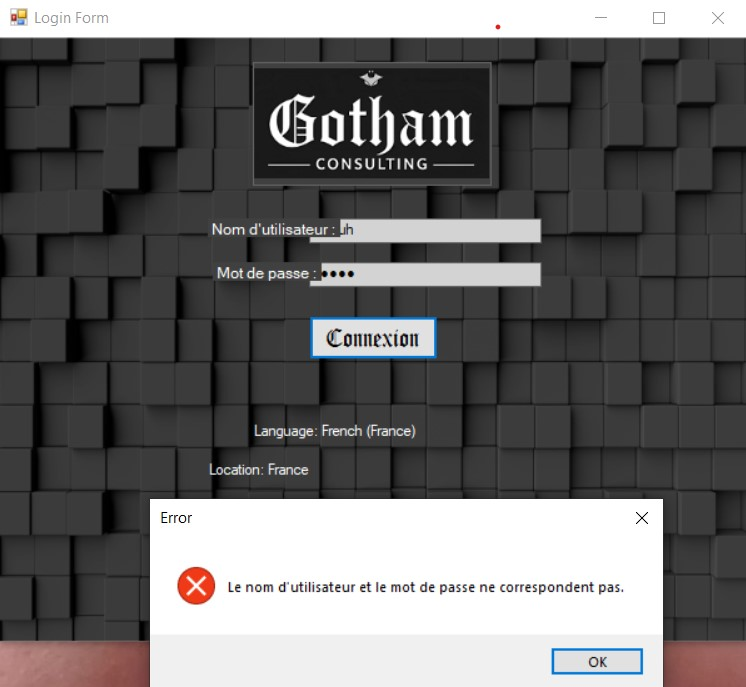
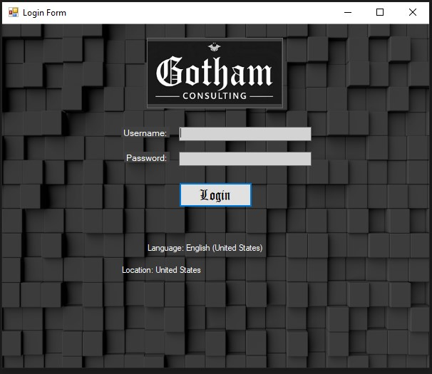
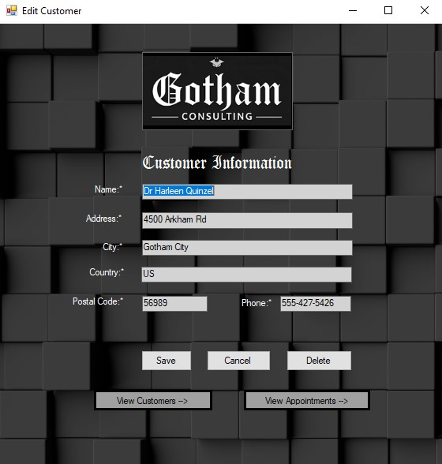
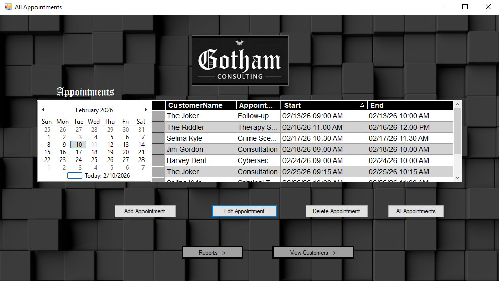
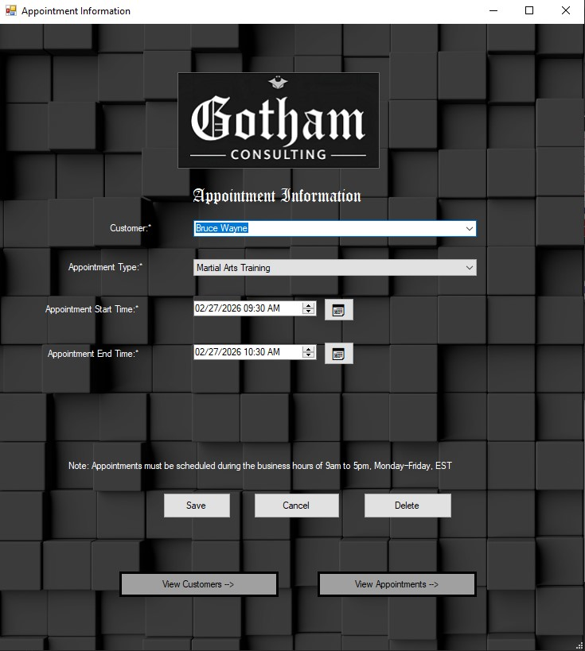
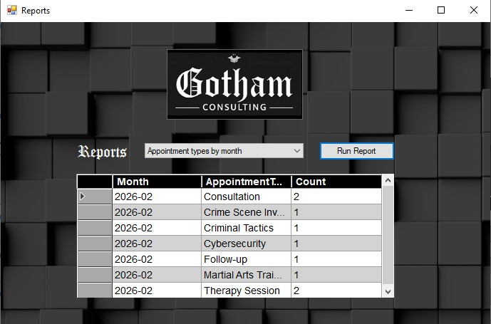
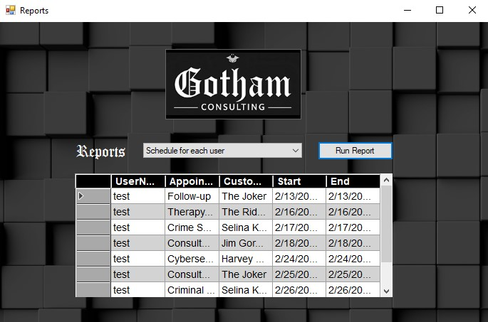
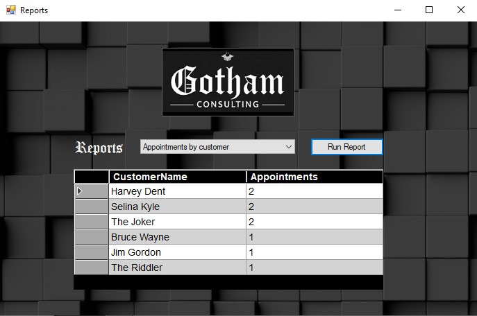

# Scheduling Application (C# WinForms)

A desktop scheduling application built with C# and Windows Forms that allows users to manage customers and appointments with time-zone–aware validation and multilingual login feedback.

## Features

- Secure user login with authentication validation
- Automatic language detection for login error messages (English / French)
- Time-zone–aware appointment scheduling
  - Appointments stored in UTC
  - Business rules validated against Eastern Time (EST)
- Customer and appointment management (add, modify, delete)
- Data persistence using a MySQL database
- Input validation and user-friendly error handling

## Technologies Used

- C# (.NET, WinForms)
- MySQL
- Visual Studio
- Git & GitHub

## Localization Example

The application detects the user’s system language and displays login error messages accordingly.

### French Login Failure Example
When the system language is set to French, failed login attempts display localized error messages.

## Screenshots

### Login

### Customers

### Edit Customer

### Appointments

### Edit Appointment

### Reports

#### Report Option 1

#### Report Option 2

#### Report Option 3

## Running the Application

1. Open the solution file (`.sln`) in Visual Studio
2. Restore NuGet packages if prompted
3. Configure the MySQL connection string
4. Build and run the application

## Notes

- Build artifacts (`bin`, `obj`) are excluded via `.gitignore`
- The application follows standard desktop application design patterns and validation practices
